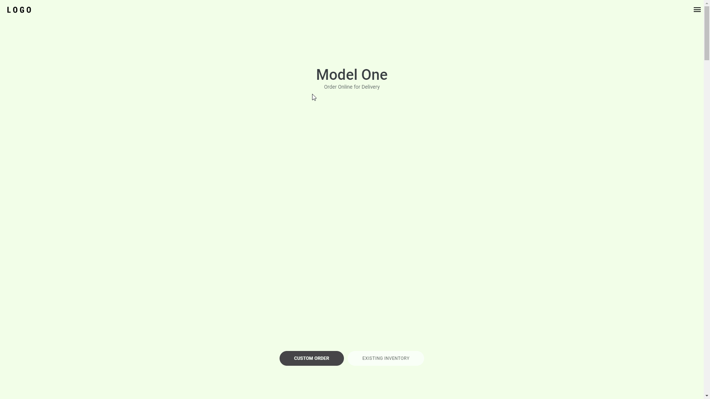
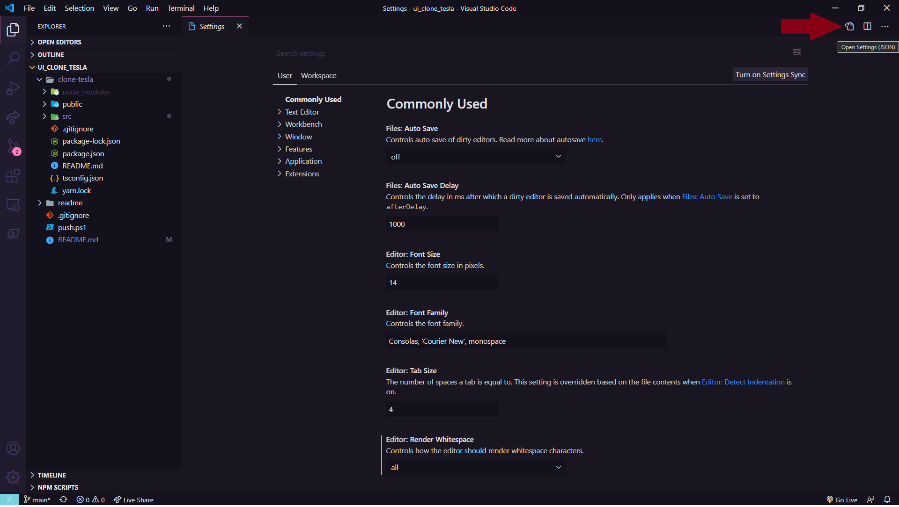
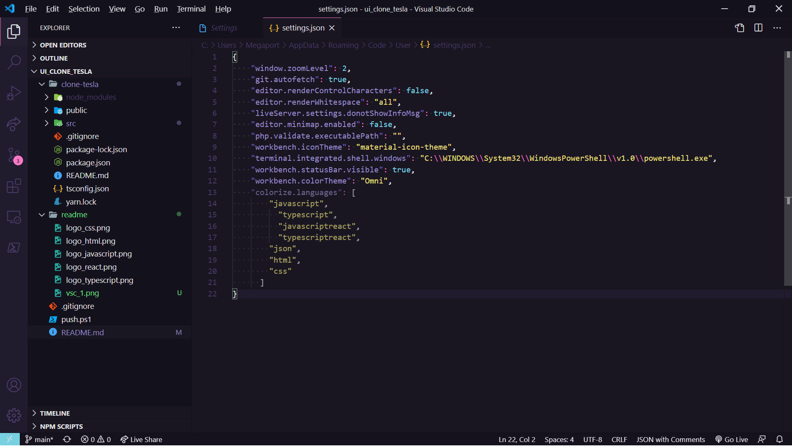

<div align="center">
    
    
    &nbsp;
    
    &nbsp;
    &nbsp;
    
    &nbsp;
    
</div>

<br>

<div align="center">

</div>

<br>

<div align="center">
:link: https://marcelosperalta.github.io/ui_clone_tesla/
</div>

# [Rocketseat](https://rocketseat.com.br/)

[Homepage da Tesla com ReactJS | UI Clone #14 | Guilherme Rodz](https://www.youtube.com/watch?v=Mf4Se4ZGcG8&t=1s)  

## Visual Studio Code Extensions

### Colorize

_install:_

[colozire](https://marketplace.visualstudio.com/items?itemName=kamikillerto.vscode-colorize)

_set up:_

File > Preferences > Settings > Open Settings (JSON):  

  

Add to ```settings.json```:

```
    "colorize.languages": [
        "javascript",
          "typescript",
          "javascriptreact",
          "typescriptreact",
        "json",
        "html",
        "css"
      ]
```

  

### vscode-styled-components

[install](https://marketplace.visualstudio.com/items?itemName=jpoissonnier.vscode-styled-components)

### Create React JS and React Native Component

[install](https://marketplace.visualstudio.com/items?itemName=ricardo-emerson.create-react-tsx-component)

### Rocketseat ReactJS

[install](https://marketplace.visualstudio.com/items?itemName=rocketseat.RocketseatReactJS)

### Rocketseat React Native

[install](https://marketplace.visualstudio.com/items?itemName=rocketseat.RocketseatReactNative)

### Bracket Pair Colorizer

[install](https://marketplace.visualstudio.com/items?itemName=CoenraadS.bracket-pair-colorizer)

## Tools

[Framer Motion](https://www.framer.com/motion/)  

[styled components](https://styled-components.com/)  

[Google Fonts](https://fonts.google.com/)  

[coolors](https://coolors.co/)  

## Start

```
npx create-react-app --template=typescript clone-tesla
```

```
yarn add framer-motion styled-components
```

```
yarn add -D @types/styled-components
```

## Run

```
yarn start
```

## Deploy to GitHub Pages

[Deployment](https://create-react-app.dev/docs/deployment/#github-pages)  